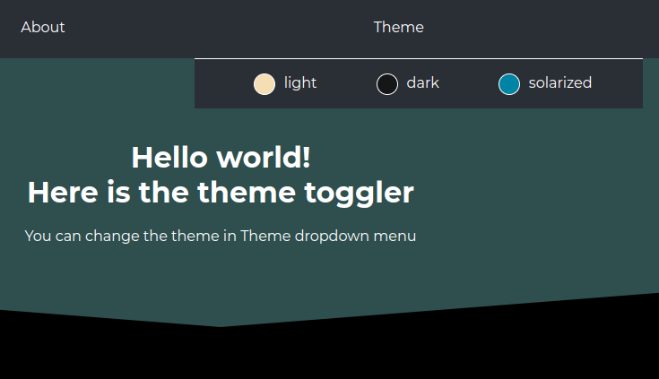

# vanilla-js-mimi-projects

### This repo contains little projects made with javascript for education and entertaiment

### Now it includes:

1. Analog clock dial

2. NextJS anime finder with SSR and Infinite Scroll

3. Simple Trello clone with drag and drop realisation

4. Glowing blob following mouse

5. Creative multicard hover effect

6. Simple pacman game

7. Parallax effect

8. Animation with planet simulation (zero js)

9. Theme toggler

10. Tic-Tac-Toe

